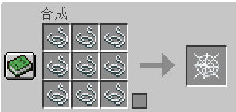

# RUA 服务器用数据包 Minecraft Datapack for RUA Server

## 自定义合成 Custom Recipes
### 1. 钻石/铁/金马铠 Diamond/Iron/Golden Horse Armor

### 2. 鞘翅 Elytra

### 3. 附魔金苹果 Enchanted Golden Apple

### 4. 鞍 Saddle

### 5. 潜影壳 Shulker Shell

### 6. +蛛网、线互相合成 Cobweb & String

### 7. +潮涌之心 Heart of the sea

### 8. +石英块 Quartz Block

### 9. +三叉戟 Trident

### 10. +弓箭 Arrow

## 快速合成 Fast Crafting
### 1. 骨头 -> 骨块 Bone -> Bone Block (无序 Unshaped)

### 2. 各式原木 -> 箱子 All Logs -> Chest (无序 Unshaped)

### 3. 各式矿车 All kinds Minecarts

### 4. 原木 + 铁 -> 漏斗 Logs + iron -> Hopper

## 自定义掉落 Custom Loot
1. 守卫者可以掉落海绵
